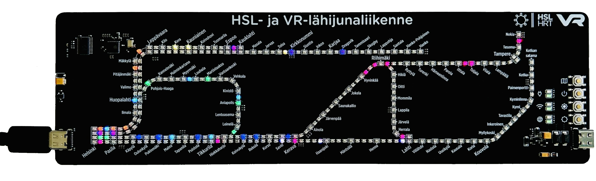
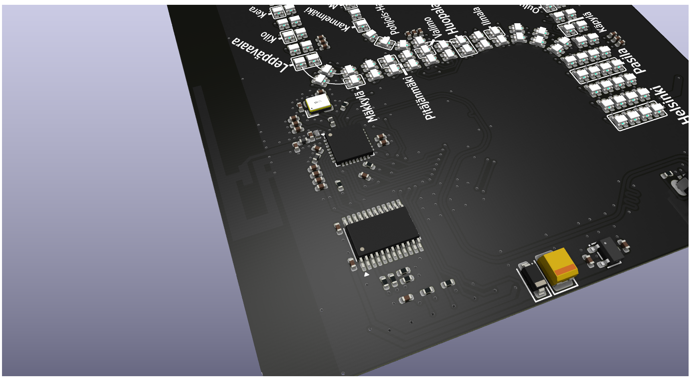
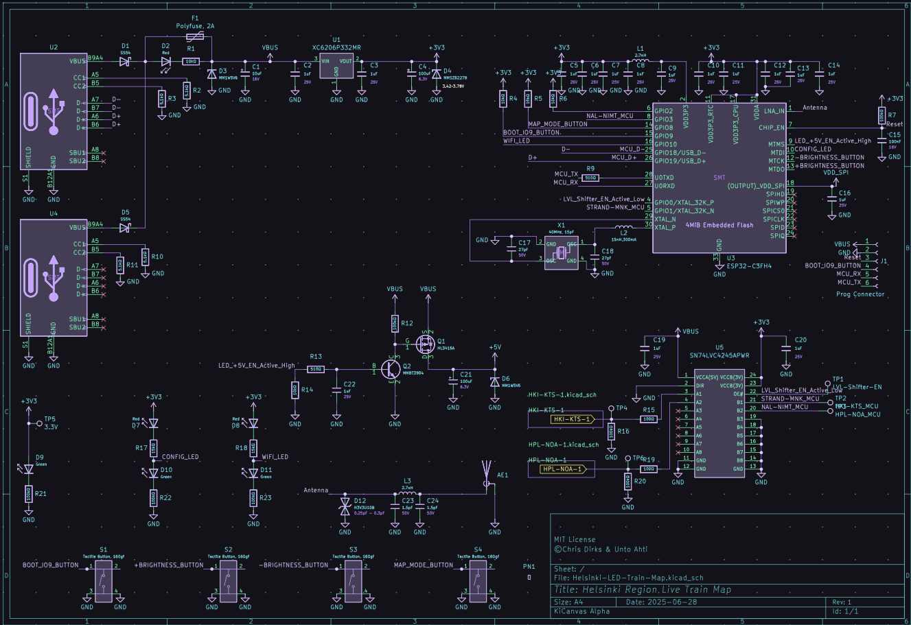

# Helsinki Live LED Train Map

A real-time PCB map of the Helsinki Region train network, powered by an ESP32-C3 microcontroller. Train movements are displayed using addressable RGB LEDs, with live data fetched over Wi-Fi.

---

## Table of Contents

- [Helsinki Live LED Train Map](#helsinki-live-led-train-map)
  - [Table of Contents](#table-of-contents)
  - [Features](#features)
  - [Hardware](#hardware)
  - [PCB Design](#pcb-design)
  - [Software / Firmware](#software--firmware)
  - [Getting Started](#getting-started)
  - [Web Installer](#web-installer)
  - [Web Simulator](#web-simulator)
  - [Stand](#stand)
  - [Server](#server)
  - [Links](#links)
  - [Contributing](#contributing)
  - [License](#license)

---

## Features

- **Real-time Train Tracking:** Displays the approximate locations of trains on the HSL and VR commuter network.
- **Addressable LEDs:** ~290 WS2812B-compatible RGB LEDs (1.6x1.5mm) for a vibrant display.
- **Wi-Fi Connectivity:** ESP32-C3's built-in Wi-Fi fetches live train data.
- **Custom PCB:** Designed for JLCPCB manufacturing limits.
- **Open Source:** Hardware and firmware are open source.

---

## Hardware

- **Microcontroller:** Expressif ESP32-C3FH4 (RISC-V, 160 MHz, 4 MB Flash, QFN32)
- **Level shifter:** Texas Instruments SN74LVC4245APWR (3.3V to 5V)
- **LEDs:** ~290 x XingLight XL-1615RGBC-WS2812B (1.6mm x 1.5mm)
- **PCB:** 249mm x 71.5mm, JLCPCB-friendly
- **Antenna:** On-board PCB antenna ([TI CC2430DB design](https://www.ti.com/lit/ug/swru125/swru125.pdf))
- **Ports:** Two USB Type-C ports for redundancy

---

## PCB Design

- Designed in **KiCad V9.0** using [JLCPCB KiCad Library](https://github.com/CDFER/jlcpcb-kicad-library)
- **View Online:** [Interactive PCB Layout (Kicanvas)](https://kicanvas.org/?github=https%3A%2F%2Fgithub.com%2FHekiNav%2Fhelsinki-live-train-map%2Ftree%2Fmain%2FPCB)
- **Source Files:** `/PCB` directory
### Schematic
Led chains are located on other pages

---

## Software / Firmware

The ESP32-C3 firmware is responsible for:

1. Connecting to Wi-Fi
2. Fetching live train data from the API
3. Processing data to determine train locations
4. Controlling WS2812B LED chains to display train positions
5. Handling button inputs and status LEDs

---

## Getting Started

1. **Flash the Firmware:**
   - Use the [Web Installer](#web-installer) (recommended, no drivers needed)
   - Or flash manually using PlatformIO (`Firmware/` directory)
2. **Connect to Wi-Fi:**
   - On first boot, use the web installer interface to configure Wi-Fi credentials. They are saved locally on the device.
3. **Power the Board:**
   - Use a 5V USB-C power supply capable of at least ~1A (~2A recommended for compatibility with higher brightness settings).
4. **Enjoy the Live Train Map!**

### Status LEDs
| LED | Light | Meaning |
|-----|-------|---------|
| top (🔌)    |🟩 green | The board is powered
| top (🔌)    |⬛ none  | The board is not powered
| top (🔌)    |🟥 red   | This shouldn't happen although it's techically possible if theres isuues in the pcb
|
| middle (ᯤ)  |🟩 green | Connected to the API
| middle (ᯤ)  |⬛ none  | Connecting to the API
| middle (ᯤ)  |🟥 red   | Failed to connect to API
|
| bottom (🌐)  |🟩 green (blinking) | Connecting to wifi
| bottom (🌐)  |🟩 green            | Connected to wifi
| bottom (🌐)  |⬛ none             | Failed to boot
| bottom (🌐)  |🟥 red              | Failed to connect to wifi

---

## Web Installer

Easily flash the latest firmware to your ESP32-C3 using your browser:

[Open the Helsinki LED Train Map Web Installer](https://hekinav.github.io/helsinki-live-train-map/led-rails.html)

- Works with Chrome, Edge, or any Web Serial-compatible browser
- Follow on-screen instructions to connect and flash your device

---

## Web Simulator

View the map without having the physical pcb:

[Open the Helsinki LED Train Map Web Simulator](https://hekinav.github.io/helsinki-live-train-map/sim.html)

- Use the map mode button to switch display modes, just like on the real thing
- Works with most modern browsers
- Fetches data from the API

---
## Stand

A 3d-printable stand to hold up the board. Files are located in `/Stand`

---

## Server

Processes train running data from [digitraffic](https://rata.digitraffic.fi/). Documenation is available at https://www.digitraffic.fi/rautatieliikenne. Most of it is only available in finnish.

### Main packages:
- express: API handling
- mqtt: Listening to MQTT train messages 
- node-sqlite & sqlite3: Database for cached train compositions and stats
- node-cron: Cron jobs for recaching data and cleaning the database

The api is tunneled to [ltm.hekinav.dev](https://ltm.hekinav.dev/). Uptime is not guaranteed.

### Running locally

Install npm packages

`npm install`

Start the api (uses port 3001 by default)

`npm start`

---

## Links

- [Web Installer](https://hekinav.github.io/helsinki-live-train-map//led-rails.html)
- [Web Simulator](https://hekinav.github.io/helsinki-live-train-map//sim.html)
- [Interactive PCB Viewer](https://kicanvas.org/?github=https%3A%2F%2Fgithub.com%2FHekiNav%2Fhelsinki-live-train-map%2Ftree%2Fmain%2FPCB)
- [JLCPCB KiCad Library](https://github.com/CDFER/jlcpcb-kicad-library)

---

## Contributing

Contributions are welcome! Open an issue or submit a pull request for improvements, bug fixes, or feature suggestions.

---

## License

This project is released under the MIT license.

© 2025 Chris Dirks & Unto Ahti
